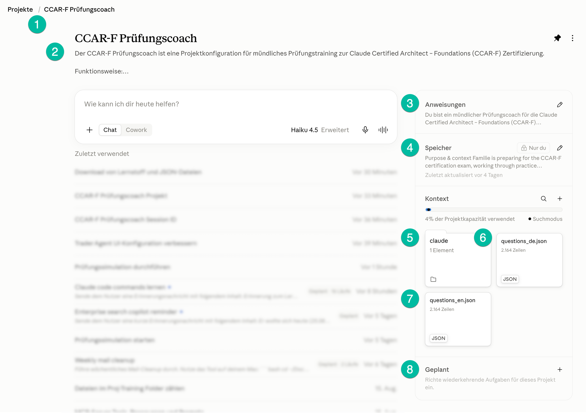

# Anleitung: CCAR-F Prüfungscoach bereitstellen und nutzen

Wie du dieses **private** Repo als Claude.ai-Projekt einrichtest oder auf Handy,
iPad, Linux-Server, Linux-PC oder Mac holst und damit den mündlichen
Prüfungscoach benutzt.

Repo: `git@github.com:AndreasBrauckmann/ccar-f-pruefungscoach.git`
(HTTPS: `https://github.com/AndreasBrauckmann/ccar-f-pruefungscoach.git`)

---

## 0. Zwei Wege, damit zu arbeiten

| Weg | Wofür | Wo |
|---|---|---|
| **A — claude.ai Projekt** (App/Browser) | Ohne Terminal, gut zum Vorlesen unterwegs, synchronisiert mit GitHub | iPhone, iPad, jeder Browser |
| **B — Claude Code** (Terminal) | Volle Kontrolle, liest `CLAUDE.md` automatisch, Fragen per Python aus dem JSON | Linux-Server, Linux-PC, Mac, Android (Termux), iPad/iPhone via SSH zum Server |

Beide brauchen den Inhalt aus diesem Repo. Weg A braucht ihn als
Projekt-Dateien; Weg B arbeitet direkt im geklonten Ordner.

---

## 1. claude.ai-Projekt einrichten (Web & App)

Das ist der einfachste Weg — besonders auf iPhone/iPad. Die Original-Einrichtung
sieht so aus:



> Wenn das Bild nicht angezeigt wird: Screenshot als `assets/claude-projekt-setup.png`
> im Repo ablegen. Die Beschreibung unten funktioniert auch ohne Bild.

### Welche Datei / welcher Text gehört wohin

| Aus dem Repo | Ziel im claude.ai-Projekt | Pflicht |
|---|---|---|
| `CLAUDE.md` — oberer Teil (Coach-Rolle + Ablauf 1–6 + Sprachwahl + „kein Markdown beim Vorlesen") | **Anweisungen** → Markierung **3** | ✅ |
| `CLAUDE.md` — Abschnitt „Projektkontext (Speicher)" | **Speicher** → Markierung **4** | empfohlen |
| `questions_de.json` (60 deutsche Fragen) | **Kontext → Dateien** → Markierung **6** | ✅ |
| `questions_en.json` (dieselben 60 Fragen, Englisch, gleiche IDs) | **Kontext → Dateien** → Markierung **7** | ✅ |
| `guide_de.md` / `guide_en.md` (Study Guide, Hintergrundlektüre) | **Kontext → Dateien** → Markierung **5** | optional |

Dateien holst du entweder über den **GitHub-Connector** im Projekt
(„Kontext" → **+** → GitHub → Repo `ccar-f-pruefungscoach` wählen — synchronisiert
Änderungen automatisch) oder du lädst sie manuell hoch (GitHub-Website: Datei
öffnen → *Download raw file*, oder mit der iOS-App **Working Copy** klonen und
exportieren).

### Die Markierungen 1–8 im Bild

1. **Brotkrümel-Navigation** „Projekte / CCAR-F Prüfungscoach". Hier springst du
   zurück zur Projektübersicht und zwischen deinen Projekten. Das Reißzwecken-Symbol
   oben rechts heftet das Projekt in die Seitenleiste.

2. **Projektname + Kurzbeschreibung.** Titel und ein bis zwei Sätze, wofür das
   Projekt da ist. Rein informativ, über das Menü (⋮) editierbar. „Funktionsweise: …"
   ist aufklappbar und darf die Kurzfassung des Ablaufs enthalten.

3. **Anweisungen** (der System-Prompt des Projekts). **Hier kommt der Coach-Text
   aus `CLAUDE.md` hinein** — Rolle, Sprachwahl („Deutsch"/„Englisch"), der
   6-Schritte-Ablauf bei „Starte die Prüfung"/„Nächste Frage" und die Regel
   „kurze gesprochene Sätze, keine Markdown-Formatierung". Diese Anweisungen
   gelten in **jedem** Chat des Projekts. Über das Stift-Symbol bearbeiten.

4. **Speicher** („🔒 Nur du" = privat, nicht mit anderen geteilt). Persistente
   Notizen, die Claude in jeder Sitzung mitliest. **Hier den Abschnitt
   „Projektkontext (Speicher)" aus `CLAUDE.md` einfügen** (Purpose & context,
   Current state, Approach & patterns, Tools & resources). „Zuletzt aktualisiert
   vor …" zeigt das Alter — nach einer Lernsitzung ggf. den Fortschritt (zuletzt
   gestellte ID, Punktestand) hier nachtragen.

5. **Kontext → Ordner / weitere Dateien (im Screenshot: `claude`, 1 Element).**
   Platz für **optionale** Hintergrundlektüre — z. B. `guide_de.md` bzw.
   `guide_en.md` (der vollständige Study Guide). Für die reine Fragenübung nicht
   nötig; kann leer bleiben oder ganz entfallen.

6. **`questions_de.json` (2.164 Zeilen).** Die **deutschen** 60 Prüfungsfragen
   im Feld `exams.ccar-f.questions`. **Pflicht.** Aus dieser Datei zieht der
   Coach die Fragen, solange „Deutsch" gewählt ist.

7. **`questions_en.json` (2.164 Zeilen).** Dieselben 60 Fragen auf **Englisch**,
   IDs identisch zur deutschen Datei. **Pflicht**, damit „Englisch" funktioniert
   und ein Sprachwechsel keine schon gestellte Frage wiederholt.

8. **Geplant** (wiederkehrende Aufgaben). Optional: z. B. „jeden Morgen 10 neue
   Fragen stellen". Für den Coach nicht erforderlich.

### Nebeninfos aus dem Bild

- **„4 % der Projektkapazität verwendet · Suchmodus":** Die beiden JSON-Dateien
  sind groß, passen aber locker. „Suchmodus" heißt, Claude durchsucht die Dateien
  gezielt, statt alles auf einmal in den Kontext zu laden — genau richtig für
  „hol Frage 17".
- **Modell / „Chat" vs. „Cowork":** Für den Coach reicht **Chat**. Ein stärkeres
  Modell (Sonnet statt Haiku) liefert ausführlichere Begründungen.
- **Mikrofon / Sprachmodus:** zum Diktieren der Antwort und zum Vorlesen der Frage.

### Loslegen

Chat im Projekt öffnen → **„Deutsch"** (oder „Englisch") → **„Starte die
Prüfung"**. Weiter siehe Abschnitt 8.

---

## 2. Zugang zum privaten Repo (einmalig je Gerät, für Weg B)

Weil das Repo privat ist, braucht jedes Terminal-Gerät eine Anmeldung. Wähle **eine**:

- **GitHub CLI** (`gh`): `gh auth login` → GitHub.com → Browser/Code bestätigen.
  Danach `gh repo clone …` ohne weiteres Setup.
- **SSH-Key**: `ssh-keygen -t ed25519 -C "geraet-name"`, den `.pub`-Inhalt unter
  GitHub → Settings → SSH and GPG keys → *New SSH key* eintragen. Dann die
  `git@github.com:…`-URL verwenden.
- **Personal Access Token** (für HTTPS): GitHub → Settings → Developer settings →
  Fine-grained tokens → nur *Contents: Read* für dieses eine Repo. Beim
  `git clone https://…` als Passwort eingeben (Benutzer = GitHub-Name).

---

## 3. Linux-Server (headless, z. B. der Raspberry Pi)

```bash
cd ~                       # oder wohin du willst
gh repo clone AndreasBrauckmann/ccar-f-pruefungscoach
#   ODER:  git clone git@github.com:AndreasBrauckmann/ccar-f-pruefungscoach.git
cd ccar-f-pruefungscoach
```

Claude Code starten (falls noch nicht installiert:
`npm install -g @anthropic-ai/claude-code` oder der offizielle Installer):

```bash
claude
```

`CLAUDE.md` wird beim Start automatisch geladen. Dann im Chat:

```
Deutsch
Starte die Prüfung
```

Nach jeder Antwort sagst du den Buchstaben; der Coach nennt dir richtig/falsch,
den korrekten Buchstaben und die Begründung und führt den Punktestand.

**Updates holen:** `git pull`
**Eigene Änderungen sichern:** `git add -A && git commit -m "…" && git push`

---

## 4. Linux-PC mit Oberfläche

Genauso wie der Server (Abschnitt 3). Zusätzlich möglich:

- **Dateien-Browser**: Repo-Ordner öffnen, `questions_de.json` in einem
  JSON-Viewer / Editor ansehen.
- **VS Code** o. ä.: Ordner öffnen, integriertes Terminal → `claude`.
- **claude.ai im Browser**: siehe Abschnitt 1 (Weg A).

```bash
sudo apt install git gh        # Debian/Ubuntu; sonst dnf/pacman
gh auth login
gh repo clone AndreasBrauckmann/ccar-f-pruefungscoach
cd ccar-f-pruefungscoach && claude
```

---

## 5. Mac (macOS)

```bash
# Homebrew vorausgesetzt
brew install git gh node
gh auth login
gh repo clone AndreasBrauckmann/ccar-f-pruefungscoach
cd ccar-f-pruefungscoach

npm install -g @anthropic-ai/claude-code   # falls noch nicht da
claude
```

Dann `Deutsch` → `Starte die Prüfung`.

Ohne Terminal geht auch: **Claude Desktop** installieren und den Repo-Ordner als
Projekt/Ordner-Kontext nutzen, oder Weg A (claude.ai) im Browser.

---

## 6. iPad

Claude Code läuft nicht direkt auf iPadOS. Drei praktikable Wege:

**6a — claude.ai-Projekt (Weg A, empfohlen, ohne Server)**
Siehe Abschnitt 1. Claude-App aus dem App Store, Projekt anlegen, die 3 Dateien
(+ CLAUDE.md-Text in „Anweisungen") wie oben beschrieben. Vorlesen per
iPadOS-Sprachausgabe oder Sprachmodus der App.

**6b — SSH zum Linux-Server (volle Terminal-Funktion)**
- App **Blink Shell** oder **Termius** installieren.
- SSH-Verbindung zum Pi/Server einrichten (Host, Benutzer, Key).
- Dort: `cd ~/ccar-f-pruefungscoach && claude` — läuft komplett auf dem Server,
  das iPad ist nur Terminal.

**6c — Repo lokal auf dem iPad**
- **Working Copy** (App): *Repositories → Clone* mit der SSH- oder HTTPS-URL,
  GitHub-Login bzw. Key hinterlegen. Danach hast du alle Dateien in der
  Dateien-App und kannst sie ins claude.ai-Projekt teilen.

---

## 7. Handy (iPhone / Android)

**iPhone:** wie iPad — Abschnitt 1 (claude.ai-Projekt) oder 6b (Blink/Termius zum Server).

**Android:**
- **Weg A:** Claude-App → Projekt → die drei Dateien hochladen, `CLAUDE.md`-Text
  als Anweisungen. Wie Abschnitt 1.
- **Weg B in Termux** (echtes Claude Code auf dem Handy):
  ```bash
  pkg update && pkg install git gh nodejs
  gh auth login
  gh repo clone AndreasBrauckmann/ccar-f-pruefungscoach
  cd ccar-f-pruefungscoach
  npm install -g @anthropic-ai/claude-code
  claude
  ```
- **SSH zum Server:** Termux (`ssh benutzer@server`) oder eine SSH-App, dann
  `cd ccar-f-pruefungscoach && claude`.

---

## 8. So läuft eine Übungs-Session (beide Wege)

1. Sprache festlegen: **„Deutsch"** oder **„Englisch"** (gilt bis du wechselst).
2. **„Starte die Prüfung"** bzw. **„Nächste Frage"**.
3. Der Coach liest `situation`, dann `question`, dann alle Optionen mit Buchstabe.
4. Du antwortest gesprochen/getippt mit dem Buchstaben (oder mit Begründung).
5. Coach: richtig/falsch, korrekter Buchstabe (`correctLetter`), kurze Erklärung
   warum richtig / andere falsch.
6. Laufender Punktestand (auf Wunsch nennen lassen: „Wie ist der Stand?").
7. „Weiter?" → nächste Frage.

Die IDs sind in `questions_de.json` und `questions_en.json` identisch — ein
Sprachwechsel wiederholt keine schon gestellte Frage.

---

## 9. Fortschritt und Updates

- **Punktestand / Notizen** nicht ins Repo committen — `score.json`,
  `progress.json`, `*.local.md` sind in `.gitignore`. Im claude.ai-Projekt den
  Stand stattdessen im **Speicher** (Markierung 4) nachtragen.
- **Neueste Fragen holen:** `git pull` (Weg B) bzw. GitHub-Connector
  synchronisieren / Dateien im claude.ai-Projekt ersetzen (Weg A).
- **Korrekturen an den Fragen:** Datei ändern → `git commit` → `git push`, dann
  auf den anderen Geräten `git pull`.
